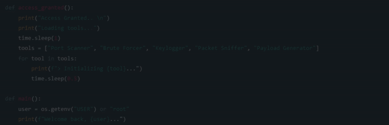

 
  ## 💫 About Me:  
🔐 Cybersecurity 🚀 Exploring AI, automation & ethical hacking 🤝 Let’s team up for something impactful 🛠️ Breaking bugs, building dreams 📚 Always curious, forever learning

## 🌐 Socials:
   

# 💻 Tech Stack:
           
# 📊 GitHub Stats:
 
 

## 🏆 GitHub Trophies

